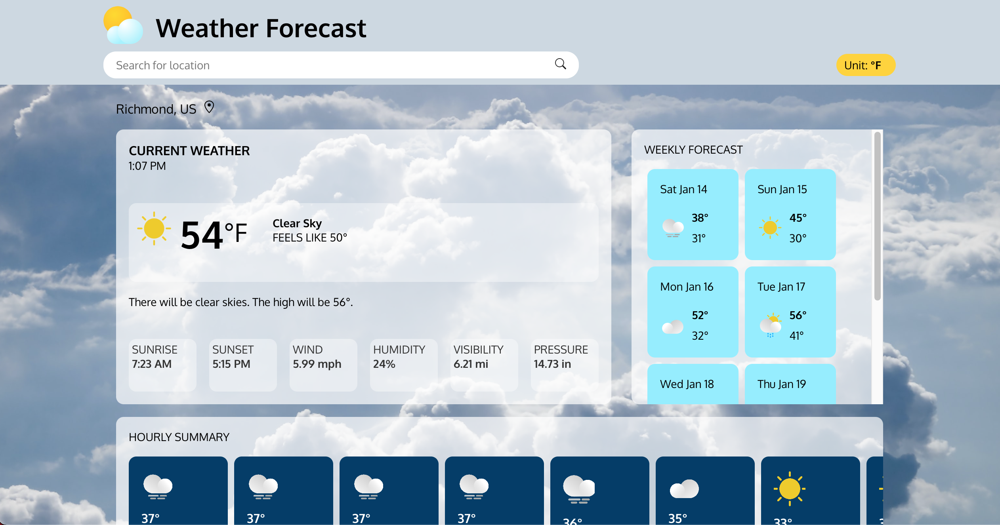

# weather-forecast

## [Live Demo](https://salvantjeff.github.io/weather-forecast/)

## Introduction

Created a current weather forecast application, made with react and OpenWeatherMap API. The project's main focus was working with APIs, specifically, fetching and extracting data from API endpoints and processing returned data to be usable in the application. A lot of effort was problem-solving the data processing and structuring; to effectively populate each component with its corresponding data. I enjoyed designing the style and layout of the app - trying to figure out how to make it appealing.

OpenWeatherMap API was utilized to access real-time weather data. The successful fetching/retrieval of the data required knowledge of Asynchronous code (Promises/Async and Await), JSON formatted data, and API endpoints. Additionally, more challenges combining asynchronous API function calls with React states and life cycle methods were solved through research and problem-solving. 

The returned processed data from the API calls were designed with the open-closed SOLID principle in mind to ensure my app will be open to extension (of adding new weather features) but closed to changing old code. 
